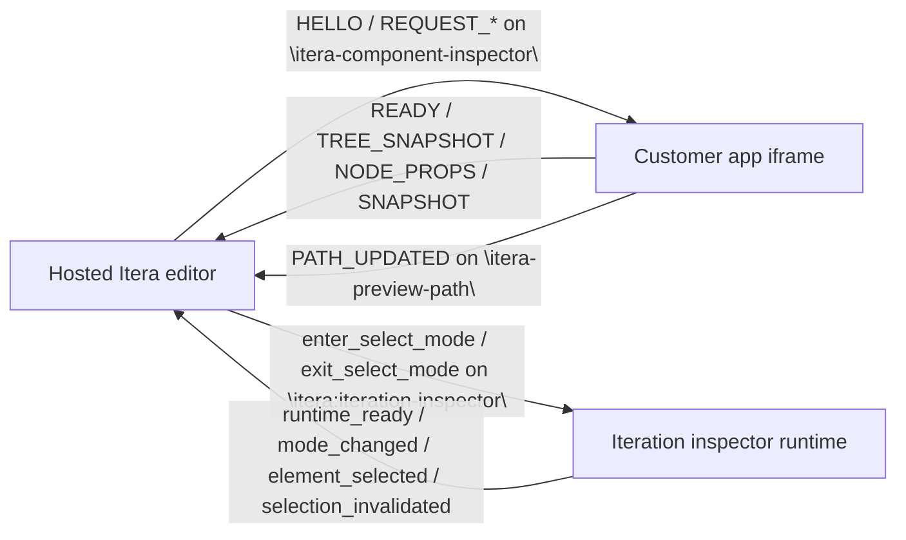

# component-inspector

Public monorepo for the Itera component inspector SDK packages. It currently includes the React and Vue client SDK packages, alongside the shared protocol package `@iteraai/inspector-protocol`.

The package names and import paths in this repo are the intended public contract. Releases are managed with
Changesets and an automated GitHub Actions release PR flow so package changes land with explicit semver intent.

Detailed customer integration guidance now lives at [iteraai.github.io/docs](https://iteraai.github.io/docs/). Start with [Getting Started](https://iteraai.github.io/docs/getting-started) and the [Inspector Overview](https://iteraai.github.io/docs/inspector/). The README files in this repo stay focused on package summaries, quick starts, and local repository workflows for npm and GitHub readers. The current docs site is React-focused; the Vue package README covers the supported Vue runtime and bootstrap contract until dedicated Vue docs land.

## Documentation

- [Docs home](https://iteraai.github.io/docs/)
- [Getting Started](https://iteraai.github.io/docs/getting-started)
- [Inspector Overview](https://iteraai.github.io/docs/inspector/)
- [React Integration](https://iteraai.github.io/docs/inspector/react)
- [Next.js](https://iteraai.github.io/docs/inspector/nextjs)
- [Vite-Style Apps](https://iteraai.github.io/docs/inspector/vite)
- [Troubleshooting](https://iteraai.github.io/docs/inspector/troubleshooting)

## Packages

| Package                              | Path                                                                         | Role                                                                                                              |
| ------------------------------------ | ---------------------------------------------------------------------------- | ----------------------------------------------------------------------------------------------------------------- |
| `@iteraai/inspector-protocol`        | [`packages/inspector-protocol`](./packages/inspector-protocol)               | Shared protocol constants, message builders, validators, origin helpers, and inspector security event constants.  |
| `@iteraai/react-component-inspector` | [`packages/react-component-inspector`](./packages/react-component-inspector) | Embedded React bridge, iteration inspector runtime, runtime telemetry helpers, and adapter/runtime configuration. |
| `@iteraai/vue-component-inspector`   | [`packages/vue-component-inspector`](./packages/vue-component-inspector)     | Embedded Vue bridge, mounted-app registration/bootstrap helpers, iteration inspector runtime, and adapter/runtime configuration. |

The repo is intentionally a monorepo so framework packages can share the same protocol and release flow without changing the repository layout.

## Release Workflow

This repo uses a merge-driven release flow for the published `@iteraai/*` packages.

1. Package-affecting PRs add a changeset with `npm run changeset:add`.
2. Merging those PRs into `main` updates or opens an automated release PR with version and changelog changes.
3. Merging the release PR publishes the changed packages from GitHub Actions with npm provenance enabled.

Changesets are expected for shipped package code, exports, package metadata, and build configuration changes
under `packages/`. They are not required for docs-only, examples-only, workflow-only, or package test-only
changes.

### First Publish Bootstrap

The steady-state release path uses npm trusted publishing from GitHub Actions and does not depend on a
long-lived publish token. There is one initial bootstrap caveat for this repository: npm trusted publishers are
configured per existing package, and these package names do not exist on npm yet.

For the first publish only, maintainers should either:

- provide a short-lived `NPM_TOKEN` repository secret so the release workflow can create the package pages, then remove the secret immediately after the first release
- or publish the first release manually from the release PR commit and configure trusted publishers before the next release

After the package pages exist, configure npm trusted publishers for `@iteraai/inspector-protocol`,
`@iteraai/react-component-inspector`, and `@iteraai/vue-component-inspector` to point at `iteraai/component-inspector` and
`.github/workflows/release.yml`, then remove any bootstrap token path. Future releases should rely on trusted
publishing only.

## Example Consumer

The repo also carries a focused customer-style fixture workspace:

| Workspace                              | Path                                                                                               | Role                                                                                                                      |
| -------------------------------------- | -------------------------------------------------------------------------------------------------- | ------------------------------------------------------------------------------------------------------------------------- |
| `component-inspector-example-consumer` | [`examples/component-inspector-example-consumer`](./examples/component-inspector-example-consumer) | Host/embed harness that imports the public package names and smoke-tests handshake, tree, props, and iteration selection. |

This example workspace exists to prove customer-style consumption against the built package entrypoints. Its Vitest smoke coverage asserts that imports resolve to `dist/`, not `src/`.

## Hosted Editor Architecture

Customer apps integrate with the hosted Itera editor through browser `postMessage` channels. This repo contains the SDK used by the embedded app side of that flow; it does not publish the first-party editor application itself.



At a high level:

- The embedded React app boots the inspector bridge and allowlists the hosted editor origins that may talk to it.
- The host sends protocol messages on `itera-component-inspector`; the embedded bridge responds with `READY`, tree data, props, snapshots, highlights, and errors.
- After the initial handshake, the embedded bridge also posts preview-path updates on `itera-preview-path` when the iframe navigates.
- The optional `iterationInspector` runtime handles element-picking UX over the separate `itera:iteration-inspector` channel.

## Supported Runtimes

The current supported customer runtimes are browser-based React and Vue apps embedded in the hosted editor flow.

- `@iteraai/react-component-inspector` is the React SDK package published from this repo today.
- React peer dependency support is `^18.3.0 || ^19.0.0`.
- Exported adapter targets are `auto`, `vite`, `next`, `cra`, and `fiber`.
- The documented embedded bootstrap helpers currently initialize the bridge with `runtimeConfig: { adapter: 'fiber' }`.
- `@iteraai/vue-component-inspector` is the Vue 3 SDK package included in this repo.
- Vue peer dependency support is `^3.4.0`.
- Exported Vue adapter targets are `auto` and `vue3`.
- Vue consumers should prefer explicit app registration via `bootstrapEmbeddedInspectorBridgeOnMount(...)` or `registerVueAppOnMount(...)`; mounted-app DOM discovery is fallback behavior.
- Bootstrap the Vue bridge during client startup, before or immediately around `app.mount(...)`, so the mounted app registry is ready as the app becomes interactive.
- Future platform packages should be added under `packages/` instead of split into separate repositories.

## Contract Identifiers

These branded identifiers are documented intentionally and should be treated as part of the supported SDK contract:

- Inspector channel: `itera-component-inspector`
- Iteration runtime channel: `itera:iteration-inspector`
- Preview-path channel: `itera-preview-path`
- Serializable placeholder discriminator: `__iteraType`

Those strings are part of the public integration surface and should not be renamed without an intentional breaking change.

## Monorepo Layout

```text
examples/
  component-inspector-example-consumer/
packages/
  inspector-protocol/
  react-component-inspector/
  vue-component-inspector/
scripts/
  validate-inspector-sdk-packages.mjs
```

Package-level summaries live in:

- [`packages/inspector-protocol/README.md`](./packages/inspector-protocol/README.md)
- [`packages/react-component-inspector/README.md`](./packages/react-component-inspector/README.md)
- [`packages/vue-component-inspector/README.md`](./packages/vue-component-inspector/README.md)

Use the docs site links above for the detailed customer integration story.

## Local Development

Use the Node version in `.nvmrc` and install dependencies from the repo root:

```bash
nvm use
npm install
```

Run the full repo checks:

```bash
npm run build
npm run lint:ci
npm run type-check
npm run test
npm run test:pack
```

Useful package-scoped commands:

```bash
npm run test --workspace @iteraai/inspector-protocol
npm run test --workspace @iteraai/react-component-inspector
npm run test --workspace @iteraai/vue-component-inspector
npm run lint:ci --workspace @iteraai/react-component-inspector
npm run lint:ci --workspace @iteraai/vue-component-inspector
npm run test:examples
```

`npm run test:pack` validates the built package shape in a clean smoke fixture so the documented import paths stay aligned with the tarballs customers will eventually install.

To inspect the example host/embed flow manually after building the SDK packages:

```bash
npm run example:host
npm run example:embedded
```
